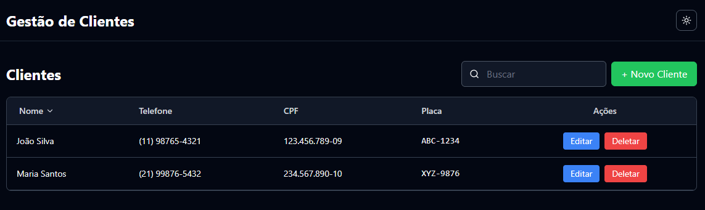

# Gestão de Clientes - Sistema Frontend Profissional

Uma aplicação frontend para gerenciamento de clientes e placas de veículos.



## Stack

- **React 18** - UI Library
- **TypeScript** - Type Safety
- **Vite** - Fast Build Tool
- **TailwindCSS** - Utility-first CSS
- **Zustand** - State Management
- **React Hook Form** - Form State Management
- **Zod** - Schema Validation
- **Vitest** - Unit Testing
- **React Testing Library** - Component Testing

## Getting Started

### Pré-requisitos

- Node.js 16+ 
- npm ou yarn

### Instalação

```bash
# Instalar dependências
npm install

```

### Desenvolvimento

```bash
# Iniciar dev server
npm run dev

# A aplicação estará disponível em http://localhost:5173
```


## Testes

```bash
# Executar testes
npm run test

```